# Figures and tables of the paper (HD)

Every figure and table of the paper, rendered from the paper source at 400 dpi. Citation numbers are those of the paper. Click an image to open it at full size; the link under it opens the same content as a searchable, clickable page.

[Back to README](../README.md#paper-to-repository-map)

## Figures

- [Fig. 1](#fig-1) · [Fig. 2](#fig-2) · [Fig. 3](#fig-3) · [Fig. 4](#fig-4) · [Fig. 5](#fig-5) · [Fig. 6](#fig-6) · [Fig. 7](#fig-7) · [Fig. 8](#fig-8) · [Fig. 9](#fig-9) · [Fig. 10](#fig-10) · [Fig. 11](#fig-11)

### Fig. 1

[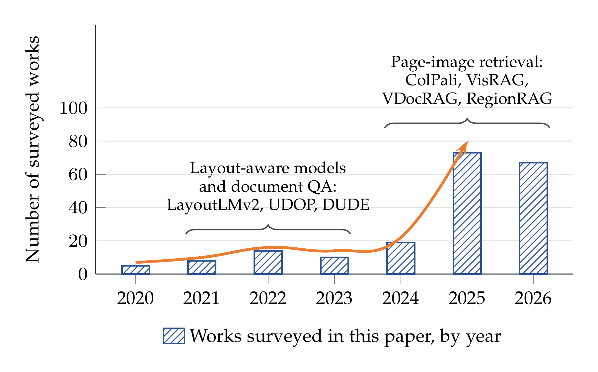](../images/fig_pubs.png)

*Number of works surveyed in this paper, by year of publication (2026 counts works up to the 24 September 2026 cut-off). The count rises sharply once page images are retrieved directly [1], [2].* [All works A-Z](all_works.md)

### Fig. 2

[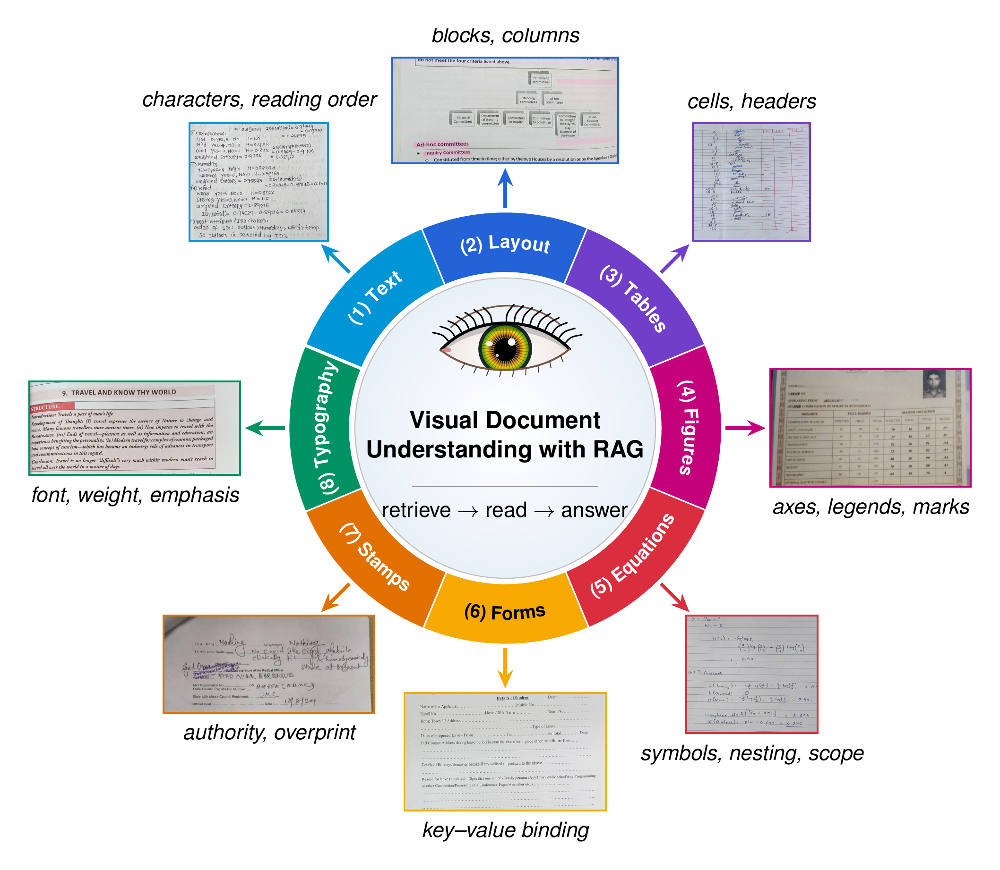](../images/fig_hub.png)

*Visual document understanding with retrieval-augmented generation must handle eight content channels at once. Each panel is a real document page dominated by one channel; on real pages the channels co-occur and overlap, as the seals printed over the text in (7) show.* [The eight channels](../README.md#the-eight-channels)

### Fig. 3

[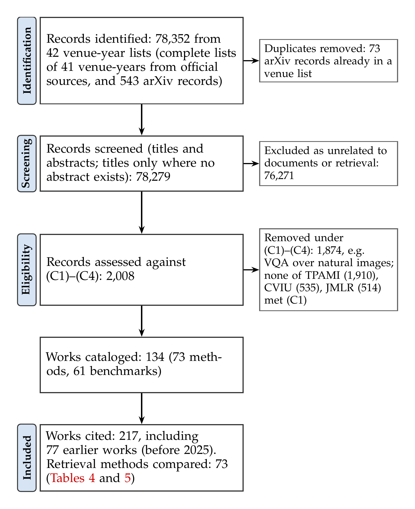](../images/fig_prisma.png)

*Literature selection flow, following the PRISMA 2020 guidelines [56]. Identification counts are complete venue-year lists retrieved from official sources, not query hits (Sec. 3.1); screening is described in Sec. 3.2.* [Search and screening terms](search_terms.md)

### Fig. 4

[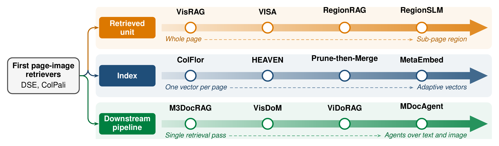](../images/fig_development.png)

*Illustration of the development of visual document RAG along three axes, from the first page-image retrievers [1], [2]: the retrieved unit [30], [59], [60], [61], the index [62], [63], [64], [65] and the pipeline [32], [66], [67], [68].* [All 73 methods](methods.md)

### Fig. 5

[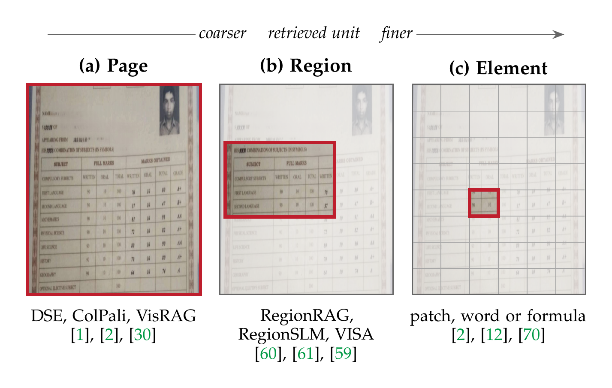](../images/fig_granularity.png)

*Three granularities of the retrieved unit on one real page: (a) the whole page, (b) a region, here the top rows of a marks table, and (c) an element, here one image patch (words and formulas are elements too). Current systems mostly return (a); the query often needs (b) or (c) (Sec. 6.3).* [Methods by index unit](methods.md)

### Fig. 6

[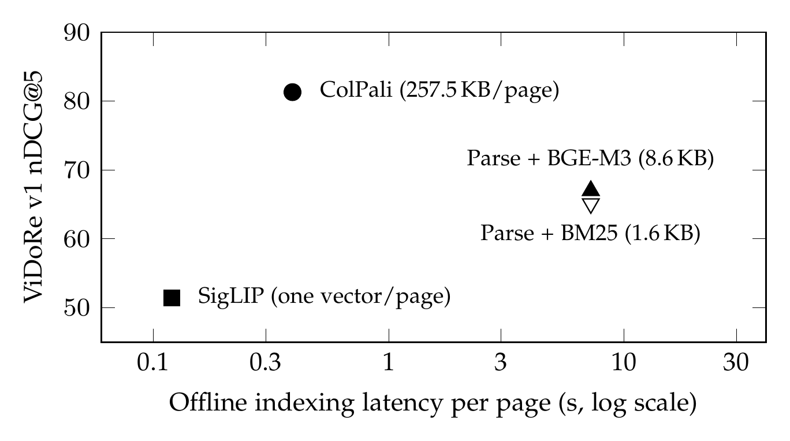](../images/fig_cost.png)

*Cost-accuracy trade-off, all values from one source and one GPU (NVIDIA L4) [2]: ViDoRe v1 average nDCG@5 against per-page indexing latency; per-page index size in brackets (measured on the DocVQA split). The two parse-based pipelines share one latency, 7.22 s per page. Skipping parsing makes indexing about 18 times faster, but the index about 30 times larger.* [Reported scores](scores.md)

### Fig. 7

[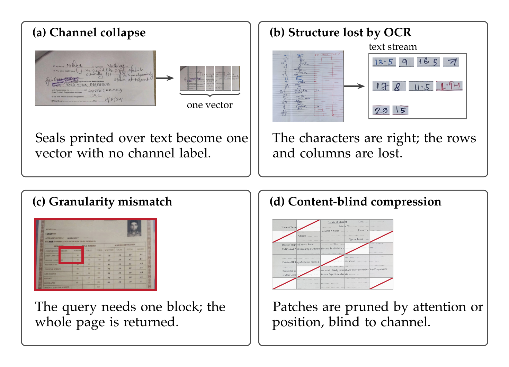](../images/fig_failures.png)

*Four recurring failure modes, shown on real pages. (a) Pooling merges co-located channels, here seals printed over text, into one unlabeled vector [33]. (b) Accurate recognition still discards table structure [87], [130]. (c) The page is returned when the evidence is one block [60]. (d) Token pruning selects by attention or position, never by channel [81], [140].* [What encoders preserve and destroy](encoders.md)

### Fig. 8

[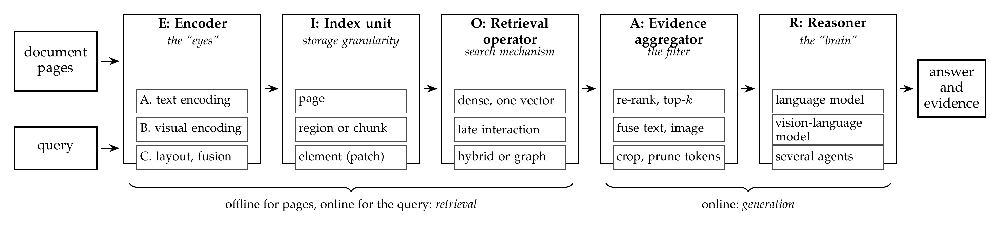](../images/fig_eioar.png)

*The EIOAR framework: every visual document RAG system is a choice of encoder (E), indexing unit (I), retrieval operator (O), evidence aggregator (A) and reasoner (R). Table 6 places representative systems in this frame.* [EIOAR table](../data/eioar.md)

### Fig. 9

[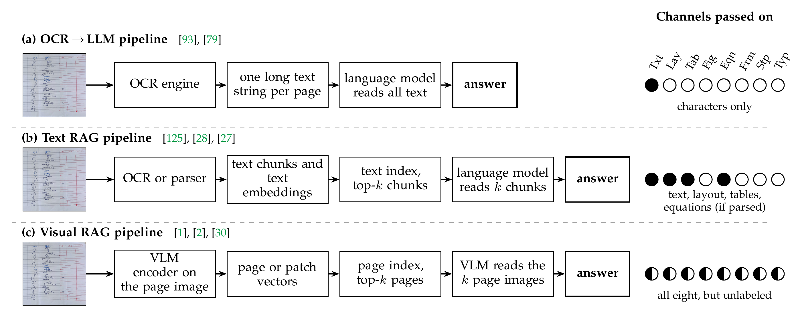](../images/fig_pipelines.png)

*Three document-understanding pipelines applied to the same real page. (a) OCR → LLM reads the recognized text; (b) text RAG retrieves parsed text chunks; (c) visual RAG retrieves page images. The circles on the right show which of the eight channels each pipeline passes on to the reader: filled if passed with its structure, half-filled if present in pixels but not labeled, empty if lost (Sec. 9.4).* [Encoder families](encoders.md)

### Fig. 10

[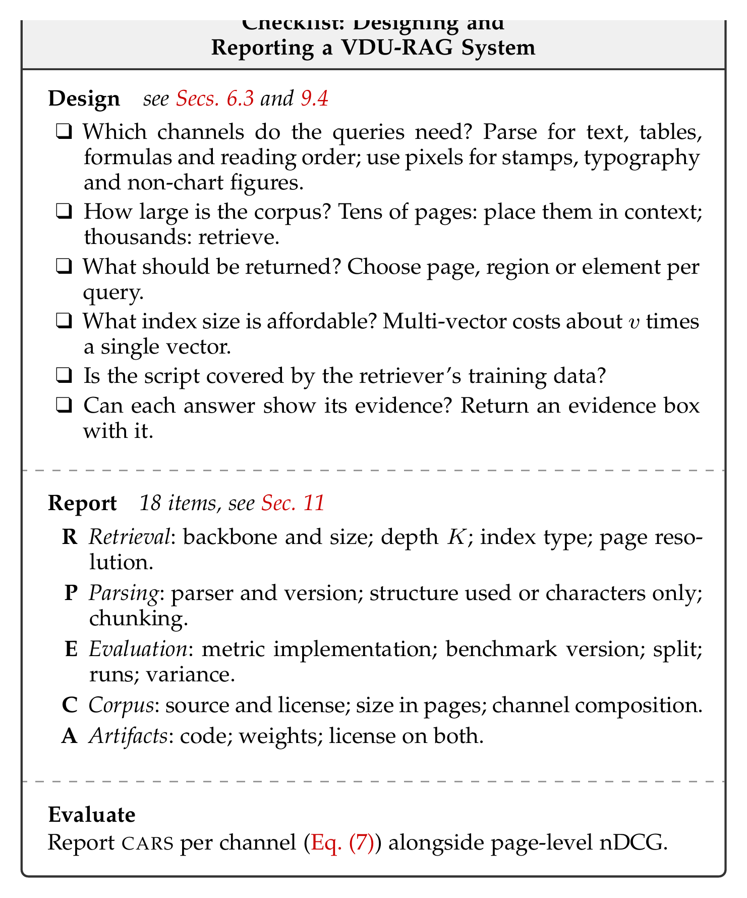](../images/fig_checklist.png)

*A design and reporting checklist for VDU-RAG systems.* [Checklist as text](checklist.md)

### Fig. 11

[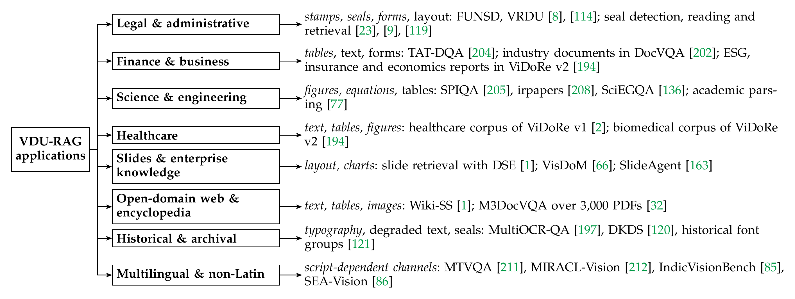](../images/fig_applications.png)

*VDU-RAG application domains and their representative systems and benchmarks, with the channels each domain depends on most. Legal and archival work depend most on stamps, seals and typography, the channels that no retrieval benchmark annotates (Table 7).* [Domains with links](applications.md)

## Tables

- [Table 1](#table-1) · [Table 2](#table-2) · [Table 3](#table-3) · [Table 4](#table-4) · [Table 5](#table-5) · [Table 6](#table-6) · [Table 7](#table-7) · [Table 8](#table-8) · [Table 9](#table-9)

### Table 1

[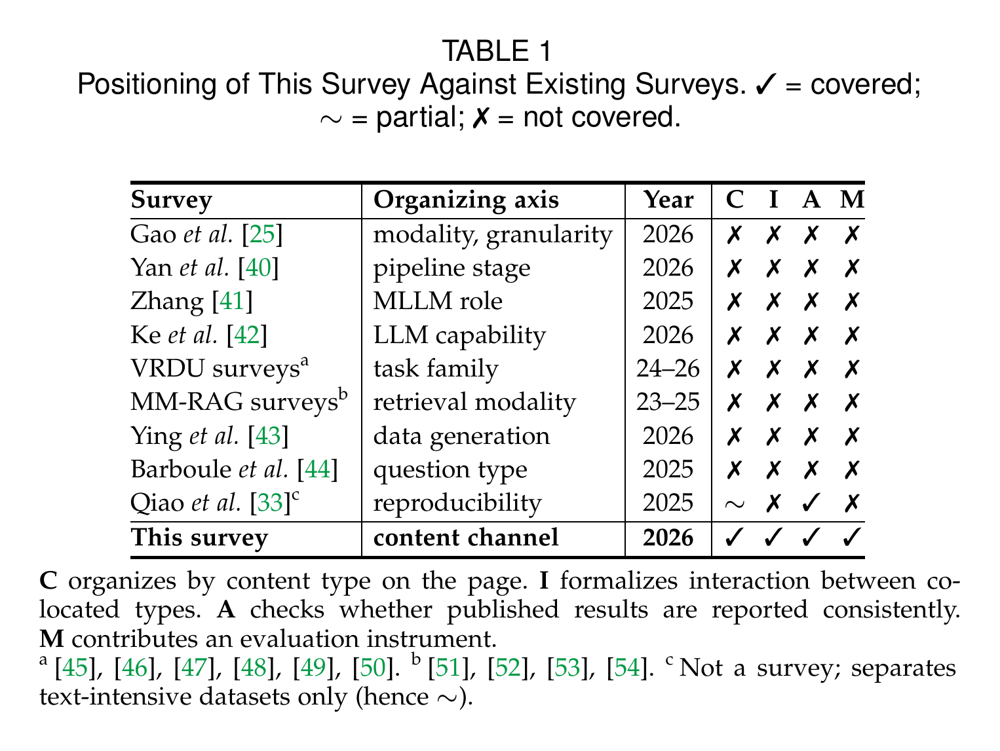](../images/tables/tab01_surveys.png)

*Positioning of This Survey Against Existing Surveys. ✓ = covered; ∼ = partial; ✗ = not covered.* [Clickable version](related_surveys.md)

### Table 2

[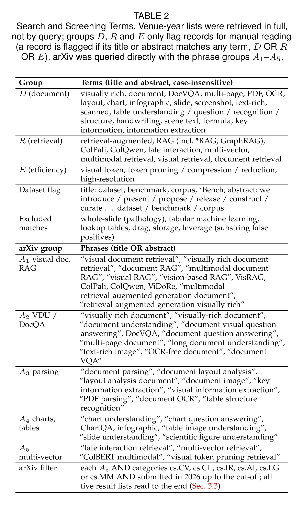](../images/tables/tab02_queries.png)

*Search and Screening Terms. Venue-year lists were retrieved in full, not by query; groups D, R and E only flag records for manual reading (a record is flagged if its title or abstract matches any term, D OR R OR E). arXiv was queried directly with the phrase groups A_1–A_5.* [Clickable version](search_terms.md)

### Table 3

[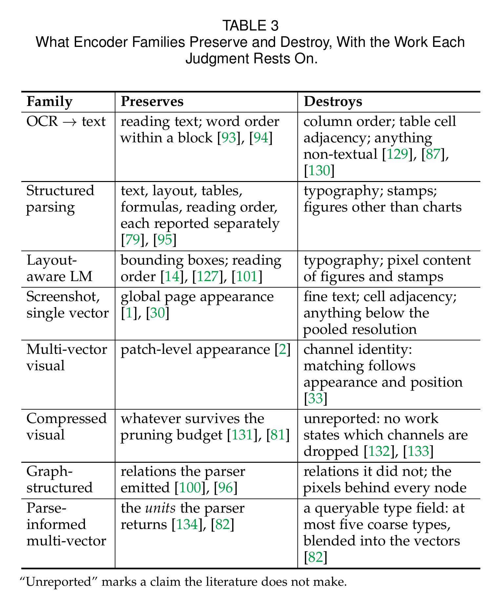](../images/tables/tab03_encoding.png)

*What Encoder Families Preserve and Destroy, With the Work Each Judgment Rests On.* [Clickable version](encoders.md)

### Table 4

[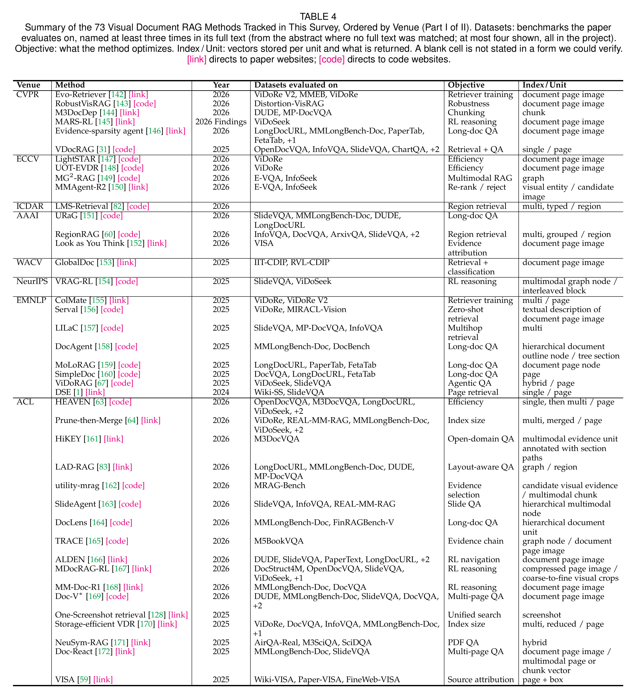](../images/tables/tab04_methods_retrieval.png)

*Summary of the 73 Visual Document RAG Methods Tracked in This Survey, Ordered by Venue (Part I of II). Datasets: benchmarks the paper evaluates on, named at least three times in its full text (from the abstract where no full text was matched; at most four shown, all in the project). Objective: what the method optimizes. Index / Unit: vectors stored per unit and what is returned. A blank cell is not stated in a form we could verify. [link] directs to paper websites; [code] directs to code websites.* [Clickable version](methods.md)

### Table 5

[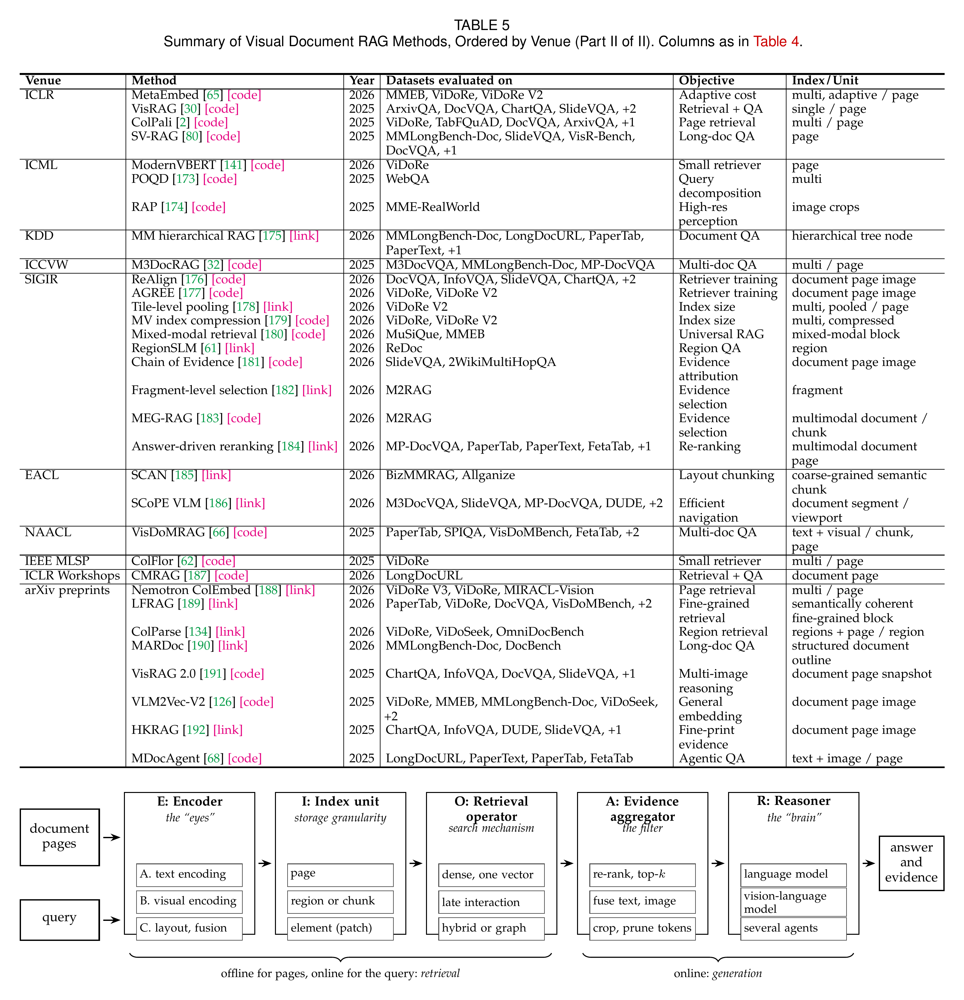](../images/tables/tab05_methods_pipeline.png)

*Summary of Visual Document RAG Methods, Ordered by Venue (Part II of II). Columns as in Table 4.* [Clickable version](methods.md)

### Table 6

[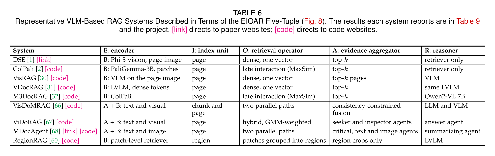](../images/tables/tab06_eioar.png)

*Representative VLM-Based RAG Systems Described in Terms of the EIOAR Five-Tuple (Fig. 8). The results each system reports are in Table 9 and the project. [link] directs to paper websites; [code] directs to code websites.* [Clickable version](../data/eioar.md)

### Table 7

[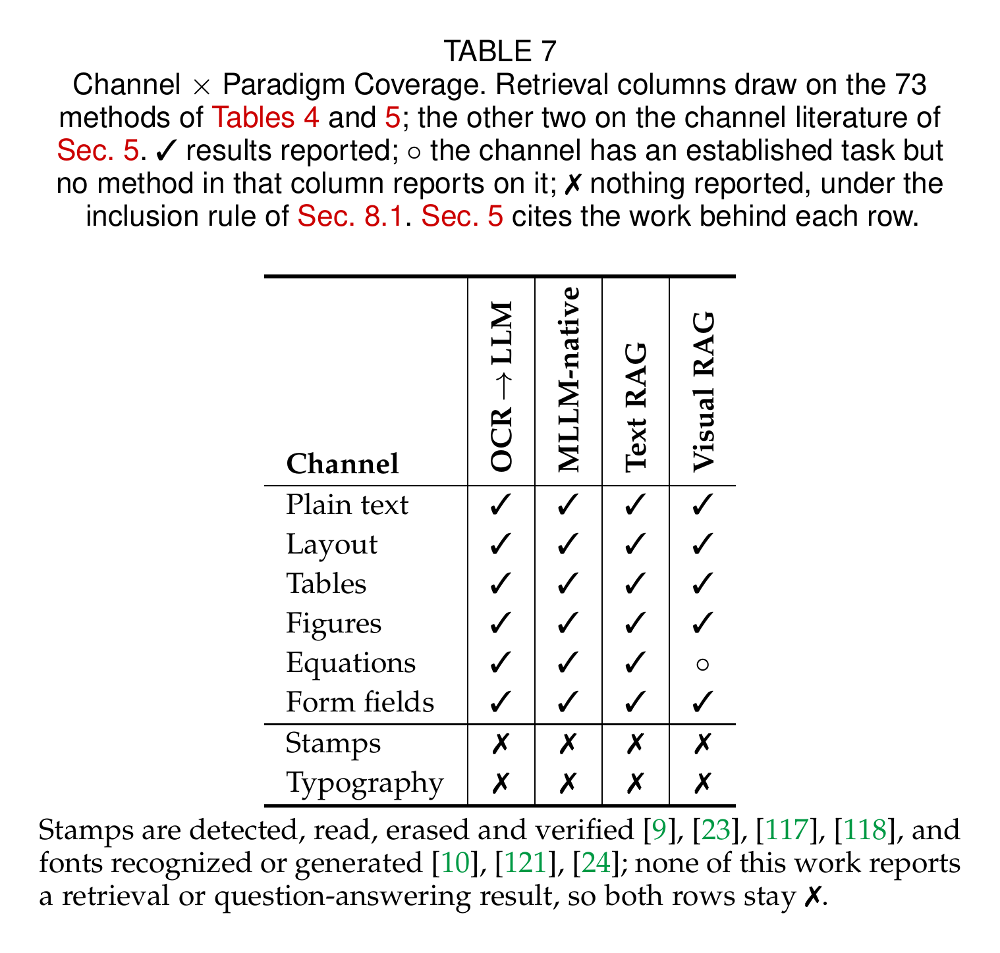](../images/tables/tab07_matrix.png)

*Channel × Paradigm Coverage. Retrieval columns draw on the 73 methods of Tables 4 and 5; the other two on the channel literature of Sec. 5. ✓ results reported; ○ the channel has an established task but no method in that column reports on it; ✗ nothing reported, under the inclusion rule of Sec. 8.1. Sec. 5 cites the work behind each row.* [Clickable version](../README.md#the-eight-channels)

### Table 8

[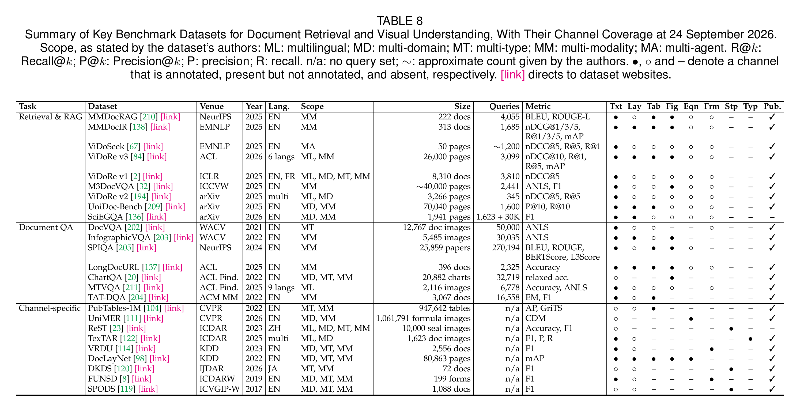](../images/tables/tab08_datasets.png)

*Summary of Key Benchmark Datasets for Document Retrieval and Visual Understanding, With Their Channel Coverage at 24 September 2026. Scope, as stated by the dataset's authors: ML: multilingual; MD: multi-domain; MT: multi-type; MM: multi-modality; MA: multi-agent. R@k: Recall@k; P@k: Precision@k; P: precision; R: recall. n/a: no query set; ∼: approximate count given by the authors. •, ○ and – denote a channel that is annotated, present but not annotated, and absent, respectively. [link] directs to dataset websites.* [Clickable version](datasets.md)

### Table 9

[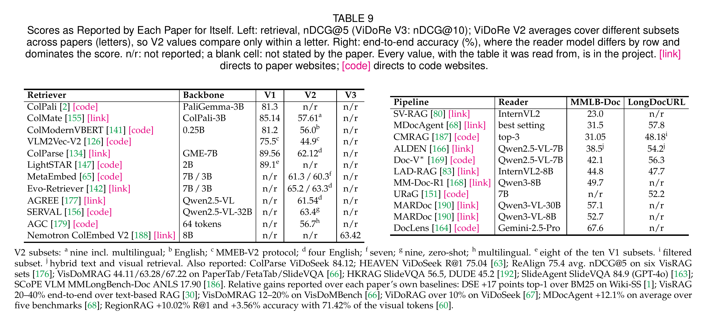](../images/tables/tab09_scores.png)

*Scores as Reported by Each Paper for Itself. Left: retrieval, nDCG@5 (ViDoRe V3: nDCG@10); ViDoRe V2 averages cover different subsets across papers (letters), so V2 values compare only within a letter. Right: end-to-end accuracy (%), where the reader model differs by row and dominates the score. n/r: not reported; a blank cell: not stated by the paper. Every value, with the table it was read from, is in the project. [link] directs to paper websites; [code] directs to code websites.* [Clickable version](scores.md)

[Back to README](../README.md#paper-to-repository-map)
